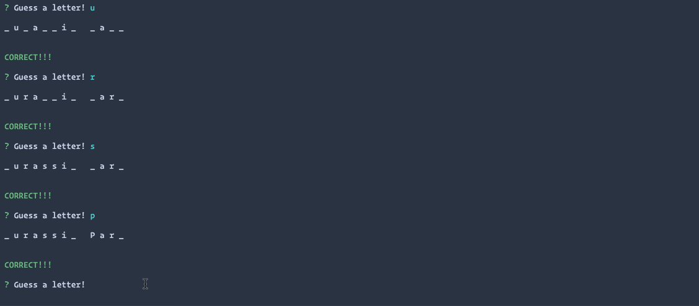

# Advanced JavaScript Assignment: Constructor Hangman

### Overview

In this week's assignment, you will create a hangman command-line game using constructor functions.

## Instructions

The completed game should meet the following criteria:

1. The completed game should be able to receive user input using the `inquirer` or `prompt` npm packages.

2. Feel free to use as many different types of constructor functions as you are able to, but at a minimum, you must create the following constructor functions:

  * **Word**: Used to create an object representing the current word the user is attempting to guess. This should contain word specific logic and data.

  * **Letter**: Used for each letter in the current word. Each letter object should either display an underlying character, or a blank placeholder (such as an underscore), depending on whether or not the user has guessed the letter. This should contain letter specific logic and data.

3. You must keep track of the user's remaining guesses and prompt the user if they would like to end the game if none remain.

4. Each constructor function should be in it's own file and be exported and required wherever needed.

5. Look into [function prototypes](https://www.thecodeship.com/web-development/methods-within-constructor-vs-prototype-in-javascript/) and use them for a few of your constructor's methods.

- - -

### Notes

* Since this assignment is a command-line application, you don't need to deploy it anywhere. You will, however, be required to upload it to Github.

* Remember to include a `package.json` file containing your project dependencies in your Github repo!

### Minimum Requirements

Attempt to complete homework assignment as described in instructions. If unable to complete certain portions, please pseudocode these portions to describe what remains to be completed.

- - -

### One More Thing

If you have any questions about this project or the material we have covered, please post them in the community channels in slack so that your fellow developers can help you! If you're still having trouble, you can come to office hours for assistance from your instructor and TAs.

**Good Luck!**

- - -

## Copyright

Coding Boot Camp © 2016. All Rights Reserved.
